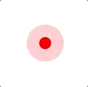

# Pulsator JS
Pulse animation with Web Animations API inspired by [Pulsator](https://github.com/shu223/Pulsator)



##  [Demo](https://shisama.github.io/Pulsator-JS/demo/)


# Usage
+ Install
`npm install pulsator --save`

+ import pulsator.js in your JavaScript files

  `import Pulsator from "pulsator"`

+ create Pulsator instance with arguments
  * element: required. parent element of pulse element
  * options: object for changing pulsator's style
  
  `const pulsator = new Pulsator(element, options)`

example(below is a part of [Demo](https://shisama.github.io/Pulsator-JS/demo/))
```js
import Pulsator from "pulsator";

const options = {
  width: "20px",
  height: "20px"
};
const parent = document.querySelector(".demo-space");
const pulsator = new Pulsator(parent, options);
const el = pulsator.getElement();
  el.style.position = "absolute";

parent.addEventListener("click", function(event) {
  el.style.left = (event.pageX - 10 /* 10px is the half of pulsator width */) + "px";
  el.style.top = (event.pageY - 10 /* 10px is the half of pulsator height */) + "px";
  pulsator.start();
});

el.onmouseover = function(event) {
  pulsator.pause();
};

el.onmouseleave = function(event) {
  pulsator.start();
};

window.onkeydown = function(event) {
  if (event.key === "Escape") {
    pulsator.stop();
  }
  if (event.key === "Enter") {
    pulsator.reverse();
  }
};
```

# API
## start()
start pulse animation

## stop()
stop pulse animation

## pause()
pause pulse animation

## reverse()
reverse pulse animation

## getElement()
get pulse element

# Browser compatibility
* Chrome 36
* Firefox 48

see [Web Animations API Browser compatibility](https://developer.mozilla.org/en-US/docs/Web/API/Web_Animations_API#Browser_compatibility)!

# LICENSE
This project is licensed under the terms of the MIT license
